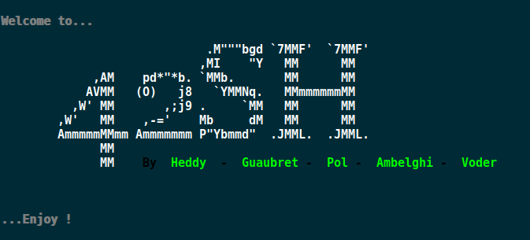

# 42project_42sh_shell_unix

This is last project at 42 school for the UNIX System specialization.

## Disclaimer

42sh shell can be compiled on all unix system, but this code was developed and tested on Linux distributions and as a result an unexpected error may occured (mostly for syscalls and signals).

## Credits

This project was done with 3 co-worker. My own party include : 
- Shell initialization
- Environment management
- Builtins Posix
- Job control
- Evaluator / Execution
- Signals handling 

## How to Run
  - clone this repository `https://github.com/bhm-heddy/42project_42sh_shell_unix`
  - Compil `make`
  - Run `./42sh`
  
  

## Ressources 

For **POSIX standards**, we mostly relied on :
- [Unix.com](https://www.unix.com/)
- [GNU.org](https://www.gnu.org/)
- [The Open Group](https://publications.opengroup.org/)

## Features

### Basic Features

- Prompt
- Command execution with arguments
- $PATH management
- Homemade error handling (no errno), and process/shell return values

### Separators and Redirections

- Redirections and fd aggregation : `>` , `>>` , `<`, `<<`, `>&`, `<&`
- Pipes : `|`
- Commands separator : `;`
- Logical operator `&&` and `||`

### Internal variables

- Shell internal variables handling
- Variable assignation `name=value`
- Variable export to environement via `export` built-in
- Local variable assignation, `ls PWD=~/`
- Special parameters managment : `$?`, `$$`, `$!`, `$-`, `$0`

### Line Editing

- Complete line editing management *(Multiple lines, Copy, Paste, home, end, arrows, etc ...)*
- Sub-prompt management

### Job Control

- Job control management
- `jobs`, `fg`, `bg`, `&` operand, built-in to interact with jobs

### Signals

- Signal managment
- Correct return value managment upon singals

### Inhibitors

- `"` double quotes, `'` simple quotes and `\` backslash inhibitors managment

### Expansion

- Simple expansion with `${}` and `$`
- Tilde expansion
- `${parameter:-word}`
- `${parameter:=word}`
- `${parameter:?word}`
- `${parameter:+word}`
- `${#parameter}`
- `${parameter%}`
- `${parameter%%}`
- `${parameter#}`
- `${parameter##}`

### History Management

- Full history management
- Expansion `!!`
- Expansion `!word`
- Expansion `!number`
- Expansion `!-number`
- Incremental research with `Ctrl + R`
- Up and down arrow research in the history
- History file save
- `fc` Built-in

### Hash table

- Hash table for binaries and built-ins 

### mode

- Non-interactive mode
- debug mode

### Built-in according to POSIX Standards (except for set and unset)

- **cd**
- **echo**
- **exit**
- **type**
- **set**
- **unset**
- **export**
- **jobs**
- **fg**
- **bg**
- **fc**
- **hash**
- **alias**
- **test**
